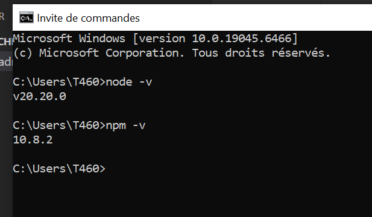
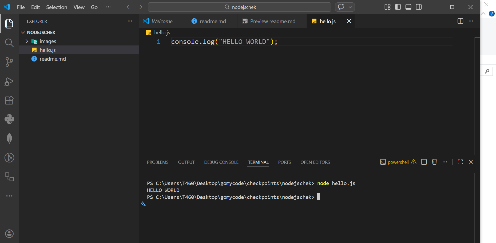
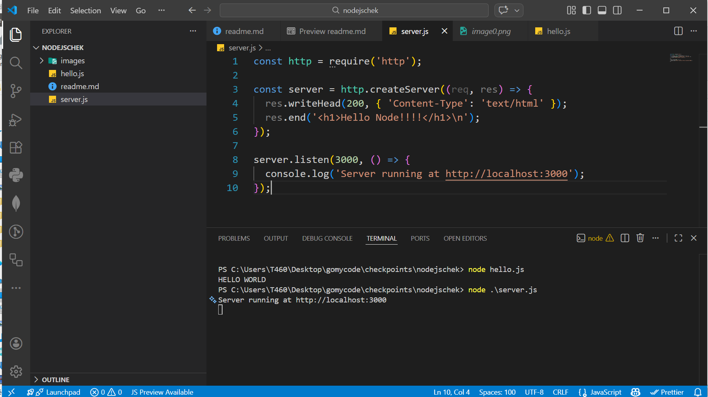
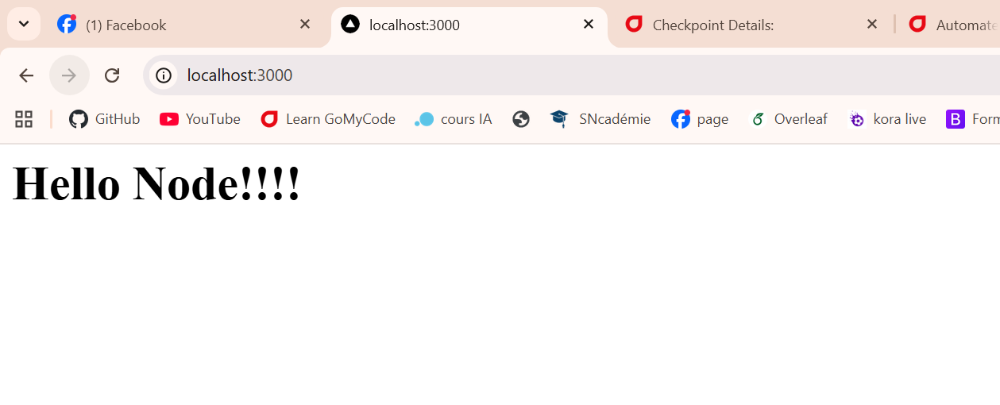
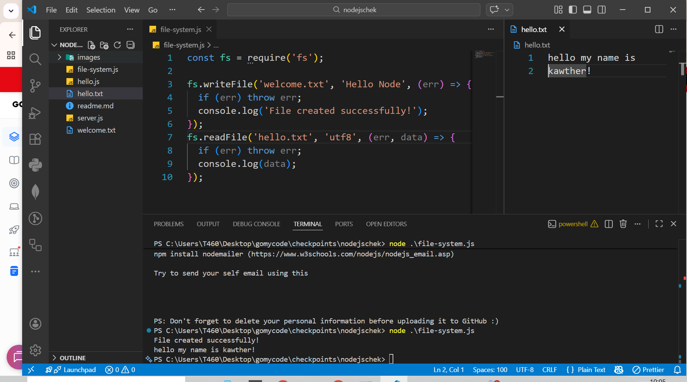
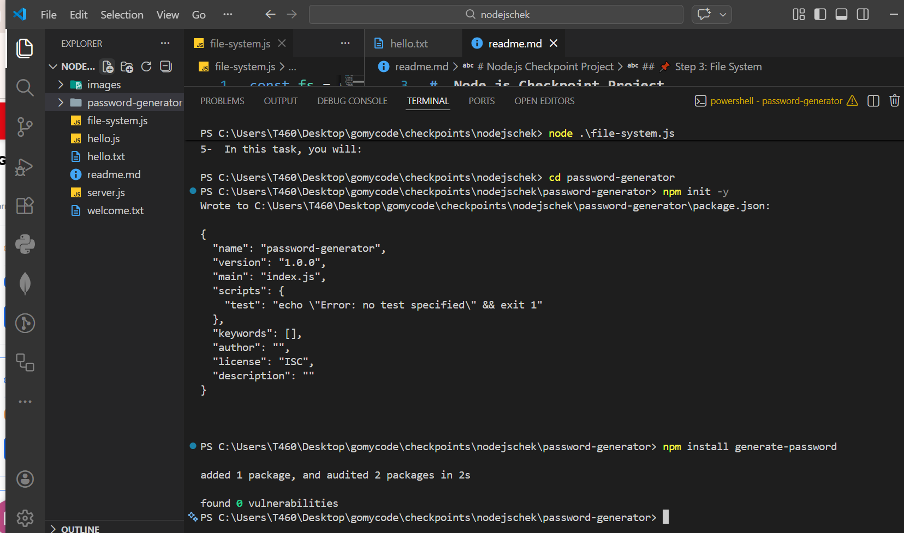
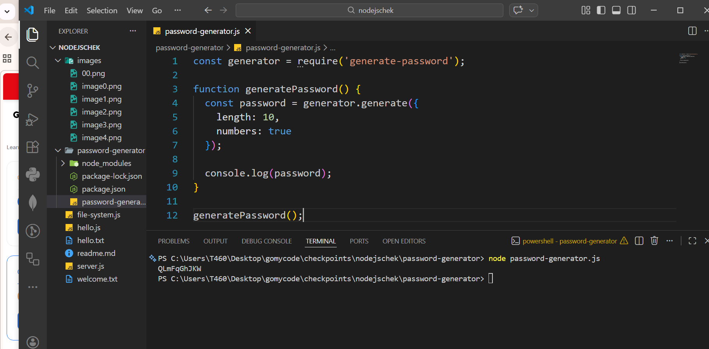
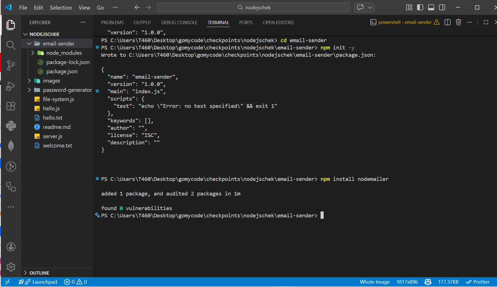
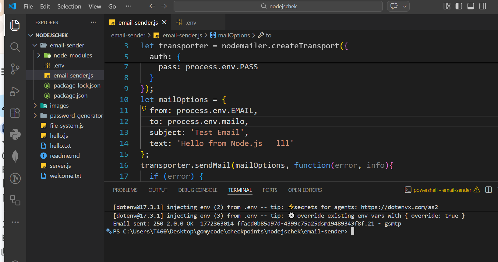
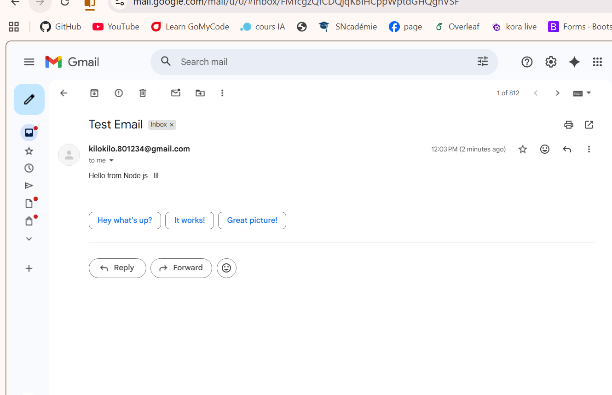

#  Node.js Checkpoint Project

This project contains a set of guided exercises to introduce the basics of **Node.js**.

Each task is implemented in a separate file as requested.

---

##  Step 0: Install Node.js

Make sure Node.js is installed on your machine.

Check installation:

```bash
node -v
npm -v
````



---

## Step 1: Hello World

 File: `hello-world.js`

This file prints **HELLO WORLD** to the console.

Run:

```bash
node hello-world.js
```

execution 



---

##  Step 2: Create a Server

   File: `server.js`

This program:

* Creates an HTTP server
* Runs on port **3000**
* Responds with:

```html
<h1>Hello Node!!!!</h1>
```

Run:

```bash
node server.js
```



Open:

```
http://localhost:3000
```



---

## 📌 Step 3: File System

 File: `file-system.js`

This task includes:

1. Creating a file named `welcome.txt` containing:

   ```
   Hello Node
   ```

2. Reading data from `hello.txt` and displaying it in the console.

Run:

```bash
node file-system.js
```



---

## Step 4: Password Generator

 Folder: `password-generator`

This task uses the package:

```
generate-password
```

Install dependencies:

```bash
npm install
```



Run:

```bash
node password-generator.js
```

It generates a random password and displays it in the console.



---

## Step 5: Email Sender

 Folder: `email-sender`

This task uses:

```
nodemailer
```

Install dependencies:

```bash
npm install
```



Run:

```bash
node email-sender.js
```

This script sends a test email using Gmail.



this the result in my mailbox


---

##  Project Structure

```
hello-world.js
server.js
file-system.js
password-generator/
email-sender/
README.md
```

---

## 🎯 Technologies Used

* Node.js
* HTTP module
* File System module
* generate-password package
* nodemailer package

---

